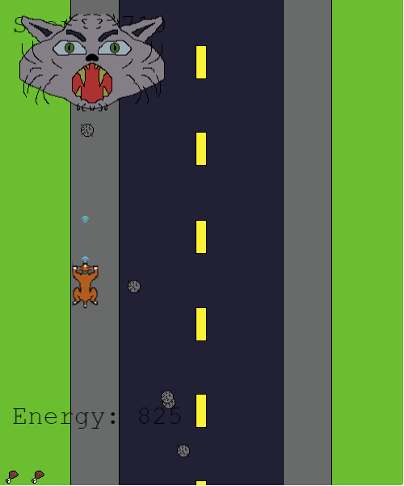
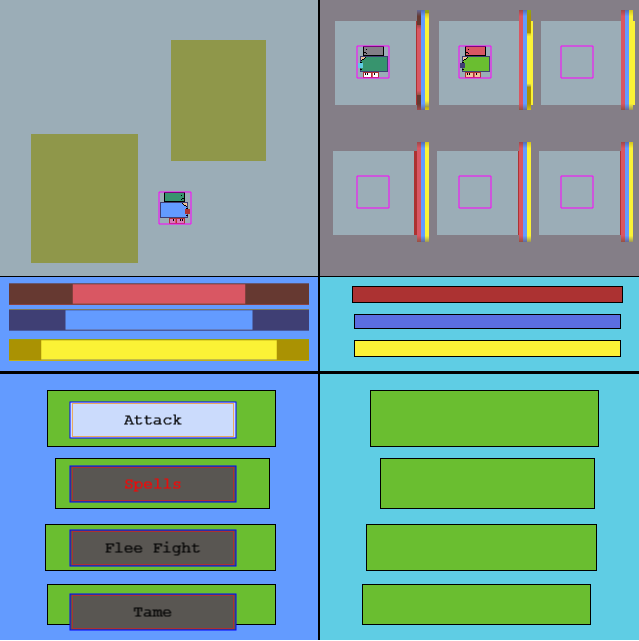

# HTML5 Games

**A compilation of a few simple work in progress html5 games, built for fun as a side project.**

## How to use
**Host a local server in the repository containing the game folders.**
**You may use the following command to use Pythons http server:** 
python -m http.server 8008

**Then connect to the local server which this hosts via the following html link:**
http://localhost:8008/

**Now simply navigate to the *game.html* file to play**

## DogShooter
A vertical scrolling shooter, where you play as my dog, 'Meeka', to bark at cats in an attempt to get to the end of the level safely. Grab bones or tennis balls for powerups and beat the boss cat at the end to win.

    
    
    

## DogFarm
The skeleton for a farming simulator, where various seeds may be sewn for different buy/sell prices with different grow times. The player needs to equip tools to harvest and seeds to sew.

    
    

## simpleRPG
An early prototype of a final fantasy styled RPG. Built to test the implimentation of hidden layers of tilemaps, designed to give an increased chance of enemy encounters when further from the path.

    
    
    

## tiledPlatforming
A basic first test of how the tileset from Tiled works and implimenting simple jumping physics

    

